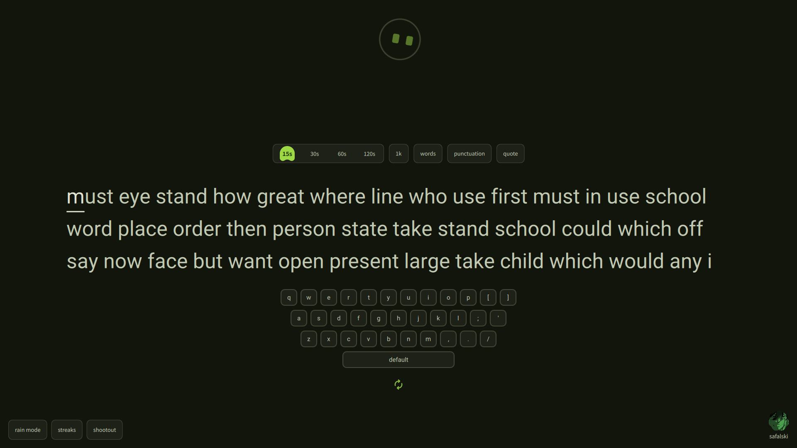

## typeShi - A Typing Application

1. Installation: `paru -Syu typeshi` or for binary only `paru -Syu typeshi-bin`
2. For Development/Contribution -> follow the clang-format & qmlformat i guess.

## preview

[Watch me Develop this..](https://www.youtube.com/playlist?list=PLTfPT4niTWcQ)

